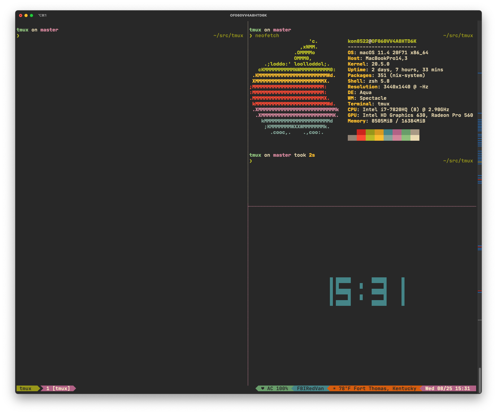

# gruvbox for [tmux](https://github.com/tmux/tmux/wiki)

> A dark theme for [tmux](https://github.com/tmux/tmux/wiki)

## Install

All instructions can be found in the [Install guide](https://github.com/janders223/gruvbox-tmux/blob/master/INSTALL.md).

## Configuration

Configuration and options can be found at [Install guide](https://github.com/janders223/gruvbox-tmux/blob/master/INSTALL.md).

## Features

* Support for powerline
* Day, date, time, timezone
* Current location based on network with temperature and forecast icon (if available)
* Network connection status and SSID
* Battery percentage and AC power connection status
* Refresh rate control
* CPU usage
* RAM usage
* GPU usage
* Color code based on if prefix is active or not
* List of windows with current window highlighted
* When prefix is enabled smiley face turns from green to yellow
* When charging, 'AC' is displayed
* If forecast information is available, a ☀, ☁, ☂, or ❄ unicode character corresponding with the forecast is displayed alongside the temperature

## Compatibility

Compatible with macOS and Linux. Tested on tmux 3.1b
FreeBSD compatibility is in development

## Praise

This plugin was shamelessly forked from the awesome folks over at draculatheme.com

## License

[MIT License](./LICENSE)
